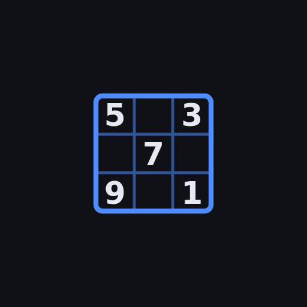

<div align="center">



# Sudoku

**Seeded generator · uniqueness-checked · local-first**

A single-page Sudoku that generates puzzles **rated against a technique ladder
rather than a clue count**, refuses to hand you a puzzle you have already played
(even in a rotated, relabelled disguise), and keeps the whole library on your
device with import/export so it can move between devices.

No build step, no framework, no backend. Static files: `index.html`, `css/`, `js/`.

[](https://github.com/Syakyr/sudoku/actions/workflows/ci.yml)
[](https://github.com/Syakyr/sudoku/releases)
[](https://github.com/Syakyr/sudoku/releases)
[](https://syakyr.github.io/sudoku/)
[](docs/DEVELOPMENT.md#the-android-apk)
[](docs/DEVELOPMENT.md#what-zero-deps-means-here)
[](LICENSE)

</div>

**In short:** difficulty = the hardest technique the cheapest logical solve needs,
not the clue count. A board accepted for tier T must be solvable with T's ladder
and not with the tier below it. That is a real guarantee about *accepted* boards —
but the upper tiers are **searched for**, not synthesised, so a share of boards
fall back to whatever the generator actually reached, and how well the labels match
how the tiers *play* is still an open question. Full detail in
[docs/DIFFICULTY.md](docs/DIFFICULTY.md); the open balancing work is tracked in
[the difficulty-calibration issue](https://github.com/Syakyr/sudoku/issues/1).

---

## Two ways to get it, and why they are different

| | **PWA** (rolling) | **Android APK** (tagged) |
|---|---|---|
| Install | Browser → "Install app" at [syakyr.github.io/sudoku](https://syakyr.github.io/sudoku/) | [Releases](https://github.com/Syakyr/sudoku/releases) / Obtainium |
| Contains | Nothing — loads the live site | The app itself, packed into the APK |
| Updates | Automatic; in-app "Update available" bar | Only when a tag is cut |
| Needs network | For the first load | Never |
| Runtime | Chrome | Android System WebView via Capacitor |

The badge above is the maintainer's reminder that these two drift apart: the web
app moves on every push to `main`, the APK moves only on a tag. **Green** means
HEAD is the shipped release; **red** means main has moved on and bundled users
are behind.

The service worker is deliberately disabled inside the APK — it would cache
files that are already local and cannot change. That is enforced by tests
(`tests/native-sw-suppressed.test.js`), not by a comment.

---

## Features

**Playing**
- 9×9 board with pencil marks, undo, erase, mistake tracking, pause-able timer
- Keyboard: `1-9` place · `0`/`Backspace` erase · `N` notes · `U` undo · `H` hint ·
  `P` pause · arrows move
- Hints are *explained*: the solver names the technique it used and which cells
  the elimination touches, rather than just dumping a digit
- Auto-solve detection, auto-save on every change, resume where you left off

**Generating**
- Five tiers: Easy / Medium / Hard / Expert / Extreme
- Optional 180° rotational clue symmetry (the newspaper look)
- Every removal is checked for a unique solution, so no puzzle here has two answers
- Seeded: the same seed + tier + symmetry always yields the identical board
- Duplicate rejection against your entire library under the full symmetry group

**Library**
- In progress / Completed / Abandoned, with per-puzzle rating, times, mistakes
- Abandoning keeps the puzzle (and your stats about it) instead of deleting it
- Share token per puzzle: `sdk-7K3P9QX2-hS-3`
- Whole-library JSON export/import (merge or replace)

**Metrics** — completion rate, win streak, day streak, per-tier average/best
time, accuracy, hint rate, notes usage, pace per empty cell, recent-vs-prior
trend, fastest solve, "what your puzzles actually needed" technique exposure,
and a next-tier suggestion.

---

## Storage, and where your data actually lives

**Settings → About** shows the version you are running and which storage channel
is active — the first two things you need when something looks wrong.

The whole library is one versioned document (`sudoku.library.v1`) with a schema
version and a tested migration path, so upgrades never corrupt or drop it. Where
that document is *kept* depends on the channel:

| Channel | Backend | Eviction risk |
|---|---|---|
| **APK** | native `@capacitor/preferences` | none — not WebView storage |
| **PWA** | `localStorage` | mitigated by `navigator.storage.persist()` |
| private mode / quota | in-memory | nothing is saved; the app says so |

The APK deliberately keeps **both** copies: the native store is the one the OS
cannot reclaim, and a synchronous `localStorage` mirror is durable immediately,
which closes the gap if the process dies mid-write. On boot the app converges on
whichever copy has the newer `updatedAt`, so a wiped or rolled-back native store
cannot silently lose a fresher session — and existing `localStorage` data is
migrated up automatically on first launch.

**Data → Download JSON** writes the whole library (puzzles, progress, ratings,
canonical keys, counters). **Upload JSON** merges it into another device, or
replaces the library entirely. Imports are symmetry-checked, so merging two
devices that independently generated the same puzzle does not poison the
uniqueness registry — and a completed copy wins over an unfinished one.

---

## Layout

```
index.html            single pane: the board. Everything else is in the drawer.
css/style.css         theme + viewport-fitting board sizing
sw.js                 PWA shell cache (never shipped inside the APK)
js/prng.js          seeded sfc32 PRNG + readable seed encoding
js/board.js         grid model, peer/unit tables, candidate bitmasks
js/solver.js        technique ladder, rating, solution counting (uniqueness)
js/generator.js     fill + dig, tier contract, share tokens
js/canon.js         symmetry canonicalisation (standard / full) + hashing
js/store.js         library document, schema + migration, import/export
js/native-storage.js  sync facade over native Preferences / localStorage
js/version.js       the version shown in Settings (CI stamps it from the tag)
js/metrics.js       all statistics, pure functions over records
js/app.js           UI controller
tools/build-dist.mjs  allowlist assembler for the bundled web app
tools/pw-check.mjs    real-Chromium visual/responsive/console check
tests/              node --test suite
android/            Capacitor native project
```

The engine and store are browser-agnostic and tested in node; only `app.js`
touches the DOM.

**One pane.** The board is sized with
`clamp(30px, min(10.5vw, (100dvh - chrome) / 9), 68px)` so it fills the
viewport and **the page never scrolls** — verified at 1280×1000, 390×844 and
740×380. Generate / Library / Stats / Data / Settings live in a drawer that
slides in from the right (hamburger, backdrop, `Esc` to close) and closes itself
whenever a puzzle loads, so generating or resuming always lands you back on the
board.

---

## Documentation

| | |
|---|---|
| [docs/DIFFICULTY.md](docs/DIFFICULTY.md) | the technique ladder, the tier contract, measured generator hit rates, the uniqueness math, share tokens |
| [docs/DEVELOPMENT.md](docs/DEVELOPMENT.md) | local dev, visual checks, Pages deploy, cutting and verifying an APK release, gotchas already paid for |

---

## Honest limitations

- **Hard/expert tiers are searched, not guaranteed.** Roughly 1 seed in 10 misses
  Hard on the first pass; the generator burns attempts until it lands in band or
  the time budget expires, then tells you what it actually got.
- **The rating ladder has a floor of "logic failed".** Past simple colouring and
  jellyfish we detect *that* the ladder stalled, not *which* exotic chain a human
  would need. Extreme-tier ratings are `7.0 + f(search work)`, a coarse proxy.
- **Hints use the cheapest step, not the best hint.** On a board with several
  available moves the hint may not be the one you were stuck on.
- **`full` canonicalisation costs ~100–145 ms per puzzle.** Fine on desktop; on a
  slow phone it is a visible pause. `canonMode: 'standard'` is available if that
  ever matters.
- **Storage is per-device and unencrypted.** Anyone with the export file has your
  whole library. That is the design, not an oversight — but do not commit one.
- **`navigator.storage.persist()` is a heuristic, not a guarantee**, on the PWA
  channel. Export if the library matters to you. The APK channel does not have
  this caveat.
